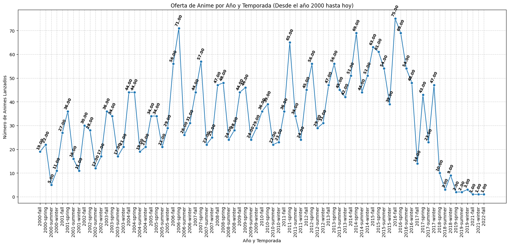
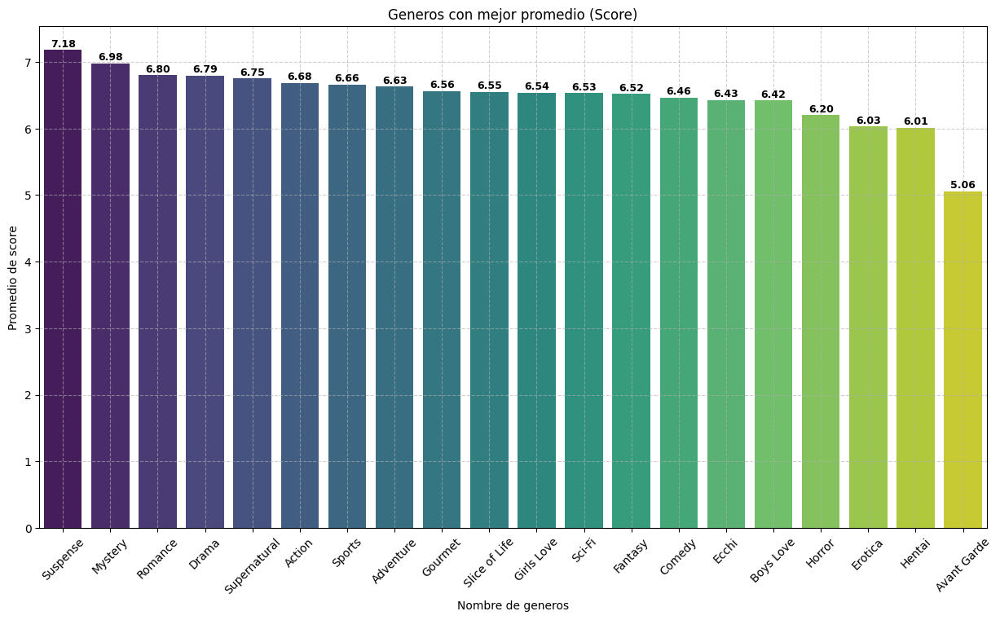
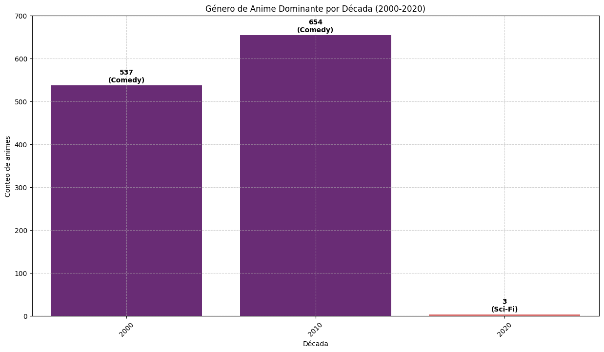
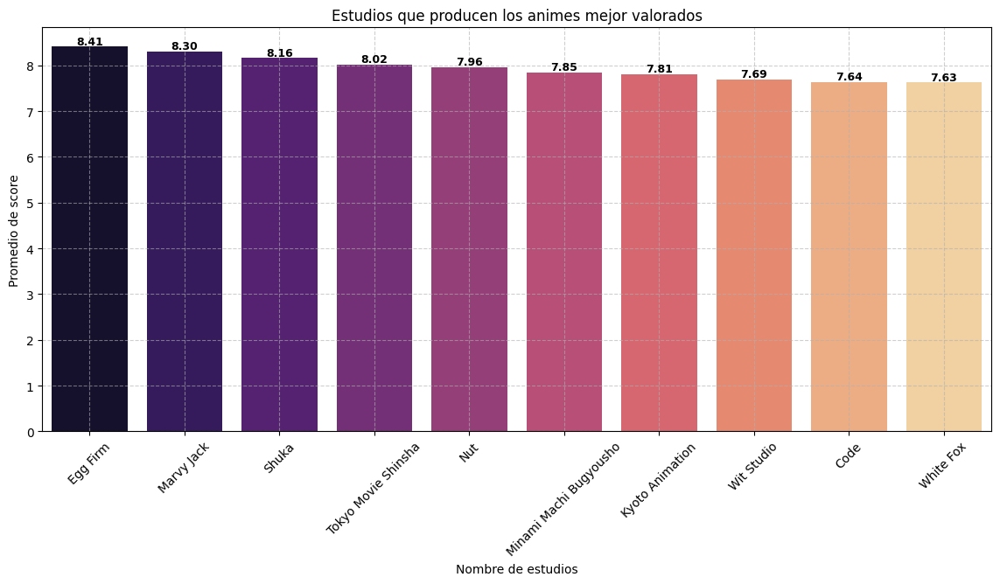
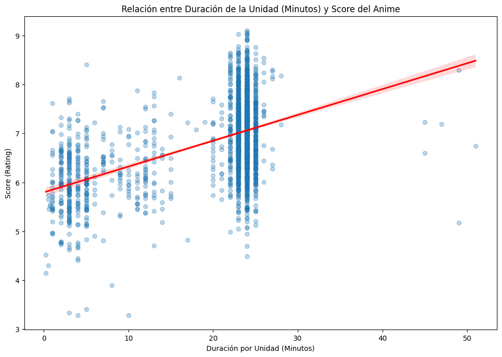
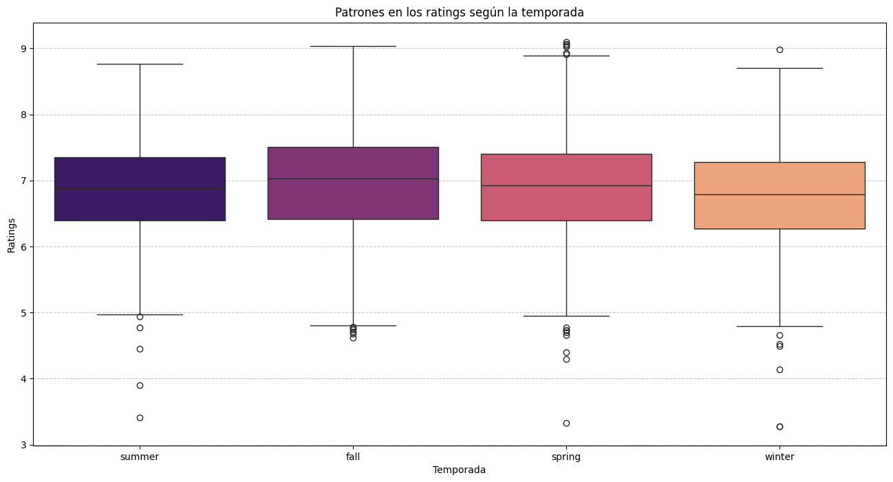

# 📊 Anime Analytics: Tendencias, Calidad y Evolución de la Industria del Anime en las Últimas Dos Décadas

## Un análisis profundo basado en datos de MyAnimeList utilizando pipelines automatizados y visualización avanzada.

Este proyecto desarrolla un sistema completo de análisis de datos centrado en la industria del anime, utilizando información pública obtenida a través de Jikan API (wrapper de MyAnimeList).
El objetivo es identificar patrones de calidad, popularidad y producción a lo largo del tiempo, evaluar el desempeño de estudios y géneros, y comprender la evolución general del anime en las últimas dos décadas.

El proyecto incluye un pipeline automatizado de extracción y limpieza de datos, análisis exploratorio avanzado, modelado estadístico ligero, y un dashboard interactivo que presenta hallazgos clave para stakeholders de la industria del entretenimiento, distribuidores, plataformas de streaming y estudios.

---

## 📚 Tabla de Contenidos

- [🎯 Propósito](#-propósito)
- [📦 Conjunto de Datos](#-conjunto-de-datos)
- [🧪 Desarrollo del Proyecto](#-desarrollo-del-proyecto)
- [📌 Vista previa del Dashboard](#-vista-previa-del-dashboard)
- [💡 Insights claves](#-insights-claves)
- [🛠️ Tecnologías](#️-tecnologías)
- [⚙️ Instalación](#️-instalación)
- [👤 Autor](#-autor)

---

## 🎯 Propósito
* Evaluar tendencias en calidad y popularidad del anime a lo largo del tiempo.
* Determinar qué factores influyen más en el éxito de un anime (estudio, temporada, género, episodios, duración).
* Comparar el desempeño entre estudios de animación.
* Identificar patrones estacionales y picos de producción.
* Facilitar decisiones basadas en datos para plataformas que licenciaron anime, estudios de doblaje o marketing.

---

## 📦 Conjunto de Datos

El conjunto de datos utilizado contiene las siguientes columnas:

1.-Tabla animes:
- `mal_id`: ID de MyAnimeList
- `titulo`: Título del anime
- `tipo`: Tipo de anime ("TV","OVA","Movie","Special","ONA","Music")
- `episodios`: Número de episodios
- `annio`: Año
- `temporada`: Temporada (Enum,"summer","winter","spring","fall")
- `clasificacion`: Clasificación de audiencia de anime ("G - All Ages""PG - Children","PG-13 - Teens 13 or older","R - 17+ (violence & profanity)","R+ - Mild Nudity","Rx - Hentai")
- `duracion`: Duración bruta analizada
- `sinopsis`: Sinopsis
- `anime_rank`: Clasificación/Categoria

2.-Tabla generos:
- `genero_id`: ID MyAnimeList
- `nombre_genero`: Nombre de genero

3.-Tabla estudios:
- `estudio_id`: ID MyAnimeList
- `nombre_estudio`: Nombre del estudio
- `favoritos`: Los favoritos de los miembros de los prouctores
- `establecido`: Fecha de establecimiento

4.-Tabla popularidad:
- `mal_id`: ID MyAnimeList 
- `score`: Puntaje
- `scored_by`: Número de usuarios
- `miembros`: Número de usuarios que han añadido esta entrada a su lista
- `favoritos`: Número de usuarios que han marcado esta entrada como favorita
- `popularidad`: Popularidad

5.-Tabla anime_generos:
- `mal_id`: ID MyAnimeList 
- `genero_id`: genero_id

6.-Tabla anime_estudios:
- `mal_id`: ID MyAnimeList
- `estudio_id`: estudio_id

Fuente: [Jikan API](https://jikan.moe/).

---

## 🧪 Desarrollo del Proyecto

### 1. **ETL(Extracción, Transformación y Carga)**
##### **1.1 Extracción**
La estracción se realizó a través de un script iterativo que recorrió 500 páginas del endpoint https://api.jikan.moe/v4/ de la Jikan API. La información se descompuso en las seis tablas relacionales finales(Animes, Popularidad, Géneros, Estudios, Anime_Generos y Animes_Estudios).

<!-- Ejemplo de código usado para la extracción de datos:
```Python
def extraccion_anime(num_paginas):
    anime_dic = {
        'mal_id': [],
        'titulo': [],
        'tipo': [],
        'episodios': [],
        'annio': [],
        'temporada': [],
        'clasificacion': [],
        'duracion': [],
        'sinopsis': [],
        'anime_rank': []
    }

    for pagina in range(1,num_paginas+1):
        url = f'https://api.jikan.moe/v4/anime?page={pagina}'

        try:
            response = requests.get(url)

            time.sleep(0.5)
            
            if response.status_code == 200:
                print('Petición exitosa')
                data = response.json()
                lista_data = data.get('data',[])
                
                for anime in lista_data:
                    lista_titulos = anime.get('titles')

                    if lista_titulos:
                        for titulo in lista_titulos:
                            titulo_ = titulo.get('title')
                            break
                    
                    mal_id = anime.get('mal_id')
                    tipo = anime.get('type')
                    episodios = anime.get('episodes')
                    annio = anime.get('year')
                    season = anime.get('season')
                    rating = anime.get('rating')
                    duracion = anime.get('duration')
                    synopsis = anime.get('synopsis')
                    rank_anime = anime.get('rank')

                    anime_dic['mal_id'].append(mal_id)
                    anime_dic['titulo'].append(titulo_)
                    anime_dic['tipo'].append(tipo)
                    anime_dic['episodios'].append(episodios)
                    anime_dic['annio'].append(annio)
                    anime_dic['temporada'].append(season)
                    anime_dic['clasificacion'].append(rating)
                    anime_dic['duracion'].append(duracion)
                    anime_dic['sinopsis'].append(synopsis)
                    anime_dic['anime_rank'].append(rank_anime)
        
            else:
                print(f'Error en la petición \nEstado: {response.status_code}')
                print(response.text)

        except requests.exceptions.RequestException as e:
            print(f'Error de conexión: {e}')

    return anime_dic
``` -->

##### **1.2 Transformación**
Durante la fase de transformación se centro en la limpieza y la estandarización de los datos. Se utilizaron valores centinela estratégicos para la imputación de nulos, permitiendo su fácil exclusión o análisis durante el modelado posterior:

| Tipo de dato | Columna afectada| Valor centinela | Propósito analítico|
| :-------- | :------- | :------------------------- |:------------------|
| `Texto(Object)` | tipo, temporada, clasificación, sinopsis| `'N/A'` |Permite filtrar fácilmente los campos de texto vacíos.|
| `Numérico (INT/FLOAT)` | score, scored_by, episodios, anime_rank, popularidad     | `'9999'`|Se excluye en el análisis utilizando la condición WHERE columna < 9999 para obtener métricas sin sesgo.|
| `Año (INT/YEAR)`| annio |`'0' (Valor bajo)` |Se utiliza un valor que garantiza la compatibilidad con el tipo de columna YEAR o INT de MySQL (resolviendo el error Out of range), sirviendo como un claro indicador de dato faltante.|
| `Fecha (DateTime)`      | establecido (Estudios) | `'2261-12-31'` |Valor futuro para marcar estudios sin fecha de fundación conocida.|


<!-- Código usado para la transformación de datos: -->
<!-- ```Python
def imputar_df(lista_df: list[pd.DataFrame]) -> list[pd.DataFrame]:

    lista_df_limpios = []

    for nombre_df, df in lista_df:
        print(f'\n--- Limpiando DataFrame "{nombre_df}" (Columnas: {list(df.columns)}) ---')

        if 'establecido' in df.columns:
            df['establecido'] = pd.to_datetime(df['establecido'], errors='coerce')
            df['establecido'] = df['establecido'].dt.strftime('%Y-%m-%d')
            imputacion_fecha = '2261-12-31'
            df['establecido'] = df['establecido'].fillna(imputacion_fecha).replace('NaT', imputacion_fecha)
            print(f"Imputado 'establecido': Nulos (NaT) rellenados con '{imputacion_fecha}'")

        if 'annio' in df.columns:
            df['annio'] = df['annio'].fillna(0)
            print(f"Imputación 'annio': Nulos rellenados con '0' ")

        # Detectar valores nulos e imputarlos con 'N/A y '0
        for columna in df.columns:
            if df[columna].isnull().any():
                
                # Verificar si el tipo de dato es TEXTO (object/string)
                if df[columna].dtype == object:
                    df[columna] = df[columna].fillna('N/A')
                    print(f"Imputado '{columna}': Nulos rellenados con 'N/A'")
                
                # Verificar si el tipo de dato es NUMÉRICO (int, float, etc.)
                elif pd.api.types.is_numeric_dtype(df[columna]):
                    df[columna] = df[columna].fillna(9999) #.astype(int) # Usar .astype(int) para asegurar enteros si aplica
                    print(f"Imputado '{columna}': Nulos rellenados con '9999'")
                
                else:
                    print(f"Columna '{columna}' contiene nulos pero no es numérica ni de texto; se omitió.")
            
        lista_df_limpios.append(df)
    
    return lista_df_limpios

def cambio_tipo_dato(lista_df):

    lista_df_tipo_correcto = []
    # Tabla anime
    tabla_anime = lista_df[0]
    tabla_anime['mal_id'] = tabla_anime['mal_id'].astype(int)
    tabla_anime['titulo'] = tabla_anime['titulo'].astype(object)
    tabla_anime['tipo'] = tabla_anime['tipo'].astype(object)
    tabla_anime['episodios'] = tabla_anime['episodios'].astype(int)
    tabla_anime['annio'] = tabla_anime['annio'].astype(int)
    tabla_anime['temporada'] = tabla_anime['temporada'].astype(object)
    tabla_anime['clasificacion'] = tabla_anime['clasificacion'].astype(object)
    tabla_anime['duracion'] = tabla_anime['duracion'].astype(object)
    tabla_anime['sinopsis'] = tabla_anime['sinopsis'].astype(object)
    tabla_anime['anime_rank'] = tabla_anime['anime_rank'].astype(int)

    #Tabla genero
    tabla_genero = lista_df[1]
    tabla_genero['genero_id'] = tabla_genero['genero_id'].astype(int)
    tabla_genero['nombre_genero'] = tabla_genero['nombre_genero'].astype(object)


    #Tabla estudio
    tabla_estudio = lista_df[2]
    tabla_estudio['mal_id'] = tabla_estudio['mal_id'].astype(int)
    tabla_estudio['nombre_studio'] = tabla_estudio['nombre_studio'].astype(object)
    tabla_estudio['favoritos'] = tabla_estudio['favoritos'].astype(int)
    tabla_estudio['establecido'] = pd.to_datetime(tabla_estudio['establecido'], format='%Y-%m-%d')

    #Tabla de popularidad
    tabla_popularidad = lista_df[3]
    tabla_popularidad['mal_id'] = tabla_popularidad['mal_id'].astype(int)
    tabla_popularidad['score'] = tabla_popularidad['score'].astype(float)
    tabla_popularidad['scored_by'] = tabla_popularidad['scored_by'].astype(int)
    tabla_popularidad['miembros'] = tabla_popularidad['miembros'].astype(int)
    tabla_popularidad['favoritos'] = tabla_popularidad['favoritos'].astype(int)
    tabla_popularidad['popularidad'] = tabla_popularidad['popularidad'].astype(int)

    #Tabla anime_genero
    tabla_anime_genero = lista_df[4]
    tabla_anime_genero['mal_id'] = tabla_anime_genero['mal_id'].astype(int)
    tabla_anime_genero['genero_id'] = tabla_anime_genero['genero_id'].astype(int)

    #Tabla anime_estudio
    tabla_anime_estudio = lista_df[5]
    tabla_anime_estudio['mal_id'] = tabla_anime_estudio['mal_id'].astype(int)
    tabla_anime_estudio['studio_id'] = tabla_anime_estudio['studio_id'].astype(int)

    lista_df_tipo_correcto.append(tabla_anime)
    lista_df_tipo_correcto.append(tabla_genero)
    lista_df_tipo_correcto.append(tabla_estudio)
    lista_df_tipo_correcto.append(tabla_popularidad)
    lista_df_tipo_correcto.append(tabla_anime_genero)
    lista_df_tipo_correcto.append(tabla_anime_estudio)

    return lista_df_tipo_correcto
``` -->

##### **1.3 Carga**
Preveio a la carga de información, se creo la base de datos junto con las tablas y las relaciones necesarias asegurando un almacen organizada de información relacionada para facilitar su gestión, acceso y actualizaciones.

La cargas se realizo en el ambiente de MySQL con una secuencia de ejecución planificada y validada de integridad:

1. Tabla padre principal: Animes
2. Tablas padres: Generos y Estudios
3. Tablas Hijos: Popularidad, Anime_Generos y Anime_Estudios

Se implemento `ON DUPLICATE KEY UPDATE` en las tablas para asegurar quie solo se almacenaran registros únicos basados en mal_id.

El proceso de ETL fue orquestado por medio de un pipeline con la finalidad de automatizar el proceso de extracción de datos, transformarlos y cargalos a la base de datos.

### 2. **Exploración inicial de datos(validación de la calidad y preparación de los datos)**
En esta exploración inicial se ejecutaron diversas consultas de las las cuales se obtubieron estos puntos:
* El score promedio general por año se mantiene consistentemente alrededor de 6.0 a 7.0, indicando que la mayoría de los títulos se sitúan en el rango "bueno" o aceptable", sin una inundación masiva de títulos sobresalientes.
* Las series de tiempo recientes (producción por año y géneros top) muestran una caída drástica en el volumen a partir de la última década, lo que es una fuerte señal de una cobertura incompleta de datos recientes de la API.
* Los géneros con mejor rendimiento en score no son los más comunes. Suspense y Award Winning lideran la calidad, mientras que la Comedia se mantiene como el género dominante en volumen de producción a lo largo de las décadas.
* Se ha establecido un ranking inicial de estudios por calidad promedio, identificando diferencias en el desempeño (alto score) y el volumen de producción.

En esta exploación tambien se verifico la imputación de los datos de los cuales se logro confirmar que se imputaron correctamente y no representan un problema a futuro(solo recordad excluirlos durante el proceso de análisis), la cantidad de información que se cargo durante el proceso de ETL concuerda con la información que se tiene en la base de datos actualmente.

### 3. **Análisis exploratorio de datos (EDA)**
#### **3.1.- Tendencias de centrales**
##### **Evolución del Rating Promedio**
La calificación promedio (score) de los animes, si bien muestra picos ascendentes y descendentes, se ha mantenido históricamente por encima de 6.5. La estabilidad de este score sugiere que la percepción general de la calidad ha sido consistente.

Nota Metodológica: Se observa una caída del promedio hasta 5.88 en los años más recientes. Esta disminución es atribuible a la incompletitud de los datos extraídos de la API, lo que sesga la muestra reciente y no refleja necesariamente una caída real de la calidad de la industria.


##### **Oferta Histórica por Temporada**
La oferta de anime experimentó un crecimiento constante y significativo desde el año 2000, con la mayoría de las temporadas alcanzando su máximo volumen de estrenos entre 2015 y 2016 (ej., 69 animes lanzados en Spring 2016).

Sin embargo, a partir de 2017, el conteo de animes por temporada disminuyó drásticamente. Es imperativo señalar que esta caída es una limitación en la cobertura de datos de la API en el periodo reciente y no representa una reducción en la producción real de la industria.

Temporada Dominante: La temporada de Spring (Primavera) concentra históricamente el mayor volumen de títulos estrenados, lo que indica una preferencia de los estudios por este periodo. 



#### **3.2.- Calidad y popularidad**
##### **El Factor Género en el Rating**
El análisis de género revela que los nichos narrativos suelen tener los scores promedio más altos, aunque no son los más comunes.

* El género Suspense lidera el ranking de calidad con un score promedio de 7.37, seguido por Mystery y Avant Garde.
* El género Comedy se posiciona como el género más dominante en volumen de producción en todas las décadas analizadas.




##### **Distinción entre Anime Sobresaliente y Promedio**
Para determinar qué diferencia a un anime sobresaliente ($\geq 8.5$ de score) de uno promedio ($6.0$ a $< 8.5$), se compararon las métricas de popularidad:

| Categoria | Total_Animes | Avg_Episodios|Avg_Votos|Avg_Popularidad|
| :-------- | :----------- | :----------- |:--------|:--------------|
| `Bajo`    | 335          | 27.0         |11950.0  | 9869.0        |
| `Promedio` | 2089        | 26.0         |109920.0 | 3939.0        |
|`Sobresaliente` | 44      | 32.0         |704559.0 | 446.0         |

La calidad sobresaliente está indisociablemente ligada a la popularidad masiva. Los animes de élite no solo reciben scores altos, sino que se convierten en fenómenos culturales consumidos por una audiencia seis veces mayor que el promedio. El bajo ranking de popularidad (446) confirma su estatus de seguimiento masivo.

#### **3.3.- Estudios de animación**
##### **Ranking de Estudios y Calidad**
El análisis del desempeño de los estudios de animación por score promedio revela una clara jerarquía de calidad. Los 10 estudios principales producen animes con scores promedio superiores a 7.0.

Top 3 Estudios por Score Promedio: Egg Firm (8.41), Marvy Jack (8.30) y Shuka (8.16).



#### **3.4.- Producción**

La duración de la unidad (episodio o película) tiene una correlación débilmente positiva con el score.

##### **Relación Duración-Rating**
* **Duración Estándar:** La duración por episodio más común es de 24 minutos. Este clúster concentra la mayor cantidad de ratings, demostrando que la duración estándar no es un predictor de la calidad.
   <table border="1" class="dataframe">
   <thead>
      <tr style="text-align: right;">
         <th></th>
         <th>titulo</th>
         <th>duracion</th>
         <th>episodios</th>
      </tr>
   </thead>
   <tbody>
      <tr>
         <th>0</th>
         <td>.hack//Roots</td>
         <td>24 min per ep</td>
         <td>26</td>
      </tr>
      <tr>
         <th>1</th>
         <td>.hack//Sign</td>
         <td>24 min per ep</td>
         <td>26</td>
      </tr>
      <tr>
         <th>2</th>
         <td>.hack//Tasogare no Udewa Densetsu</td>
         <td>23 min per ep</td>
         <td>12</td>
      </tr>
      <tr>
         <th>3</th>
         <td>009-1</td>
         <td>24 min per ep</td>
         <td>12</td>
      </tr>
      <tr>
         <th>4</th>
         <td>07-Ghost</td>
         <td>23 min per ep</td>
         <td>25</td>
      </tr>
      <!-- <tr>
         <th>...</th>
         <td>...</td>
         <td>...</td>
         <td>...</td>
      </tr> -->
      <tr>
         <th>2664</th>
         <td>iDOLM@STER Xenoglossia</td>
         <td>23 min per ep</td>
         <td>26</td>
      </tr>
      <tr>
         <th>2665</th>
         <td>s.CRY.ed</td>
         <td>24 min per ep</td>
         <td>26</td>
      </tr>
      <tr>
         <th>2666</th>
         <td>xxxHOLiC</td>
         <td>24 min per ep</td>
         <td>24</td>
      </tr>
      <tr>
         <th>2667</th>
         <td>xxxHOLiC◆Kei</td>
         <td>24 min per ep</td>
         <td>13</td>
      </tr>
      <tr>
         <th>2668</th>
         <td>ēlDLIVE</td>
         <td>24 min per ep</td>
         <td>12</td>
      </tr>
   </tbody>
   </table>

   <table border="1" class="dataframe">
   <thead>
      <tr style="text-align: right;">
         <th></th>
         <th>duracion</th>
         <th>mal_id</th>
      </tr>
   </thead>
   <tbody>
      <tr>
         <th>18</th>
         <td>24 min per ep</td>
         <td>1050</td>
      </tr>
      <tr>
         <th>17</th>
         <td>23 min per ep</td>
         <td>635</td>
      </tr>
      <tr>
         <th>19</th>
         <td>25 min per ep</td>
         <td>214</td>
      </tr>
      <tr>
         <th>23</th>
         <td>3 min per ep</td>
         <td>120</td>
      </tr>
      <tr>
         <th>33</th>
         <td>5 min per ep</td>
         <td>100</td>
      </tr>
      <tr>
         <th>16</th>
         <td>22 min per ep</td>
         <td>97</td>
      </tr>
      <tr>
         <th>12</th>
         <td>2 min per ep</td>
         <td>73</td>
      </tr>
      <tr>
         <th>27</th>
         <td>4 min per ep</td>
         <td>55</td>
      </tr>
      <tr>
         <th>0</th>
         <td>1 min per ep</td>
         <td>47</td>
      </tr>
      <tr>
         <th>3</th>
         <td>12 min per ep</td>
         <td>31</td>
      </tr>
   </tbody>
   </table>

* **Tendencia:** La línea de regresión muestra una ligera elevación en el rango de 50 a 120 minutos, indicando que las unidades más largas (Películas, OVAs) tienden a tener scores marginalmente más altos. Esto probablemente se deba al mayor presupuesto y valor de producción por unidad de tiempo inherente a estos formatos. 

   

#### **3.5.-Estacionalidad**
##### **Patrones de Estreno**
No existe un patrón fuerte en los ratings que favorezca consistentemente a una temporada sobre las otras. La calidad media (mediana) y la dispersión (outliers) de los scores son similares entre Spring, Summer, Fall y Winter. La calidad es, por lo tanto, más dependiente del estudio y el equipo de producción que del mes de estreno. 



---

## 📌 Vista previa del Dashboard

---

## 💡 Insights claves

**1. El "Efecto de Validación Masiva"**
   
   La métrica más determinante para un anime de élite no es solo su calificación, sino su volumen de interacción. Mientras que un anime promedio posee alrededor de 110,000 votos, los títulos sobresalientes ($\geq 8.5$) promedian más de 700,000. Esto indica que la "calidad" en esta industria está estrechamente ligada a la capacidad de una obra para convertirse en un fenómeno de masas y mantener la relevancia entre millones de usuarios.
- [Insight 2]
- [Recomendación práctica o estratégica basada en los datos]

---

## 🛠️ Tecnologías

- Python
   - Pandas
   - Matplotlib
   - Seaborn
   - Numpy
   - mysql-connector-python
   - requests
- Jupyter Notebook
- Power BI

---

## ⚙️ Instalación

### 1. Clonar este repositorio:
```bash
git clone https://github.com/tu_usuario/nombre_del_proyecto.git
```
### 2. Uso de un Entorno Virtual para Aislar Dependencias

Para evitar conflictos con versiones de librerías, se recomienda usar entornos virtuales.

####  Crear y Activar un Entorno Virtual

##### Crear el entorno virtual:
```
python -m venv venv
```
##### Activar el entorno:
* #### En Windows:

    ```
    venv\Scripts\activate
    ```

* #### En Mac/Linux::

    ```
    source venv/bin/activate
    ```
#### 3. Instalar dependencias dentro del entorno:
* #### Opición 1:
    ```
    pip install -r requirements.txt
    ```

* #### Opción 2 (De forma manual):
    ```
    pip install numpy pandas matplotlib seaborn scikit-learn
    ```

---

## 👤 Autor

**Said Mariano Sánchez** – *smariano170@gmail.com*  
Este proyecto forma parte de mi portafolio como analista de datos Jr.

---

## 📝 Licencia

Este proyecto está licenciado bajo la **Licencia MIT**. Puedes usarlo, modificarlo y distribuirlo libremente, siempre que menciones al autor original.

---